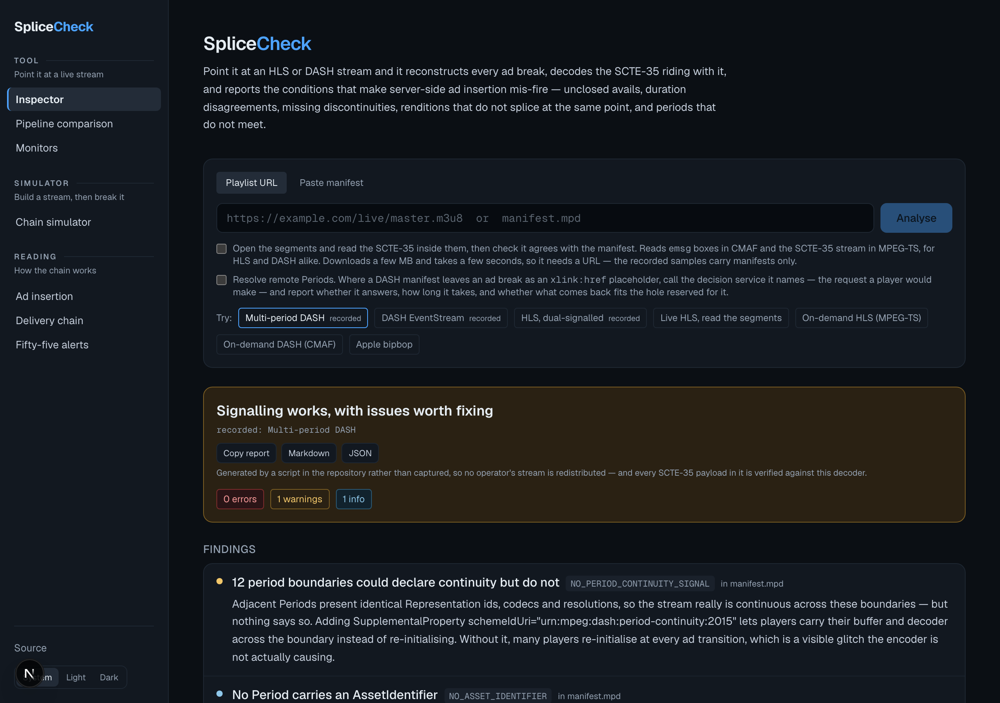
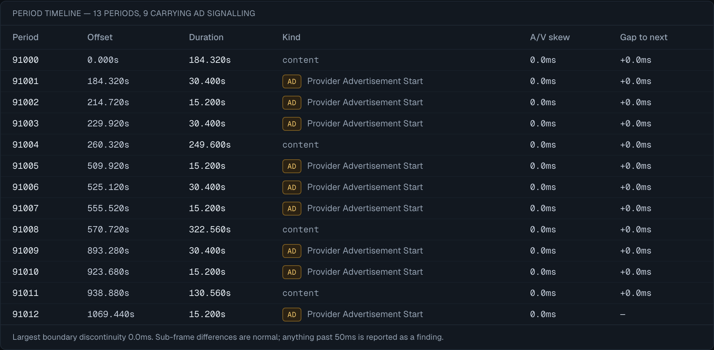
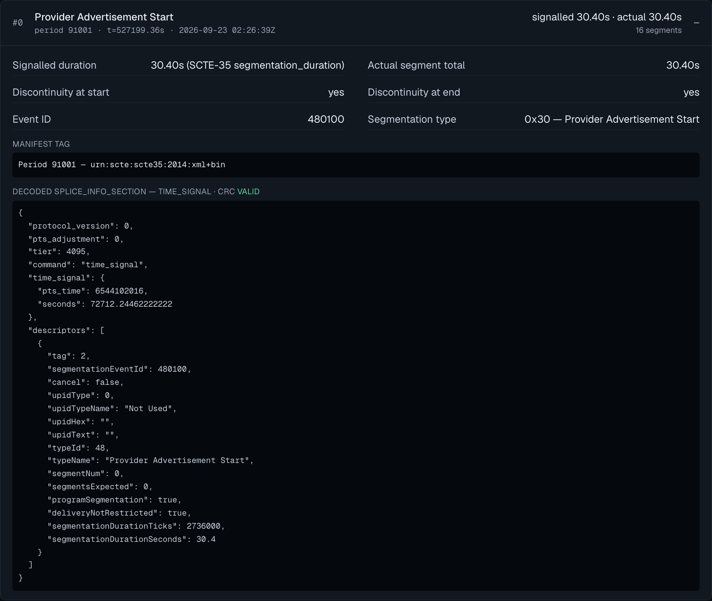
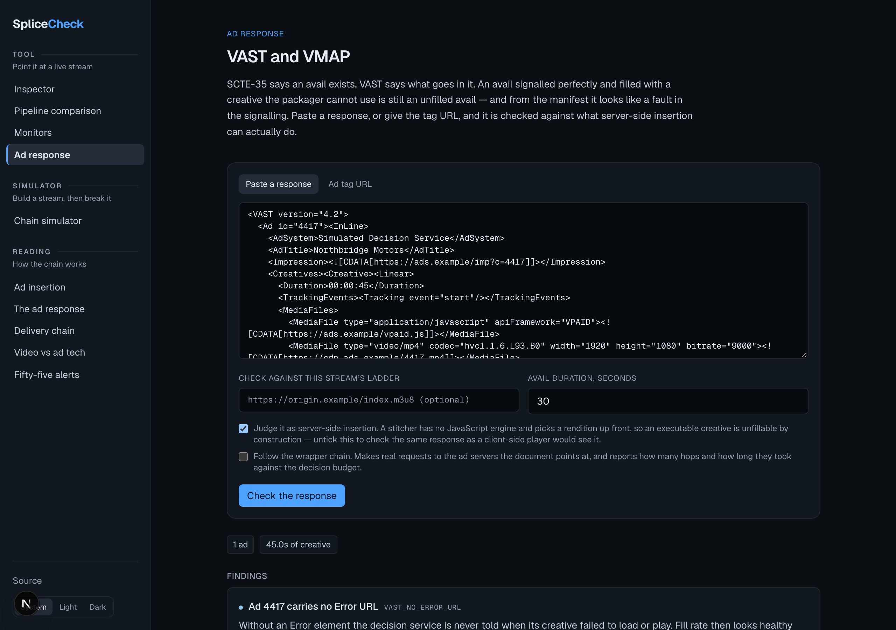
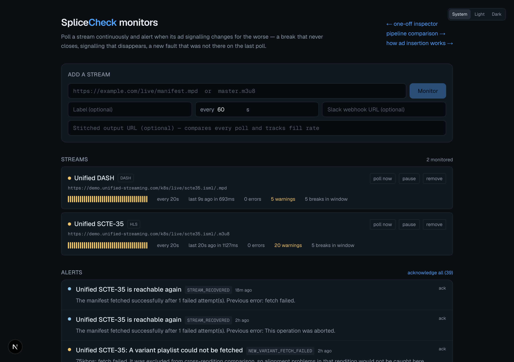
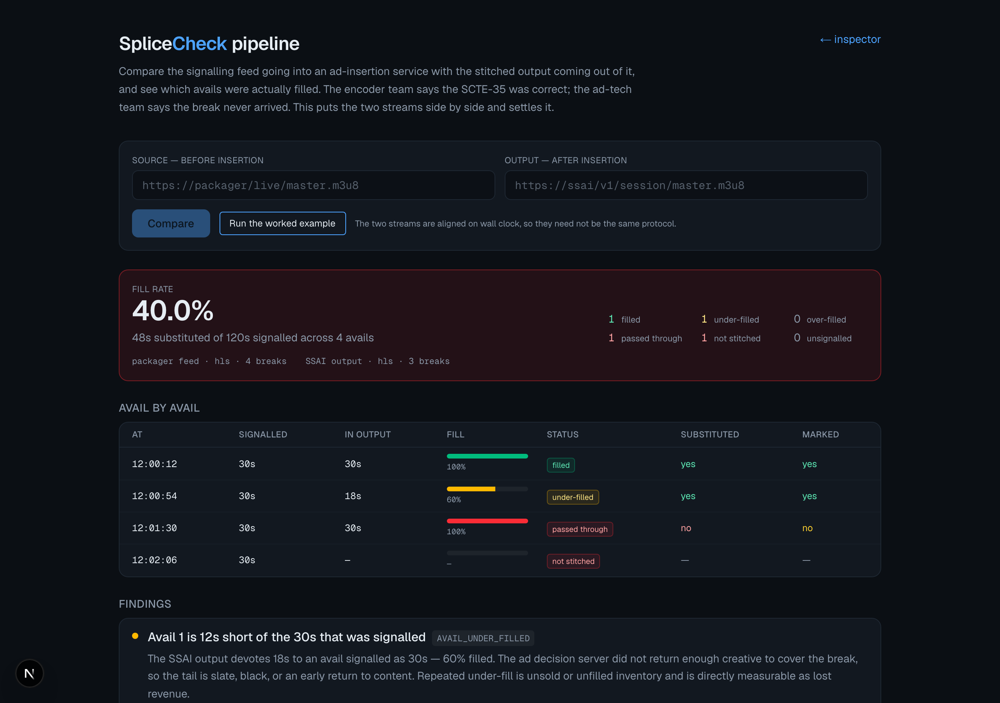
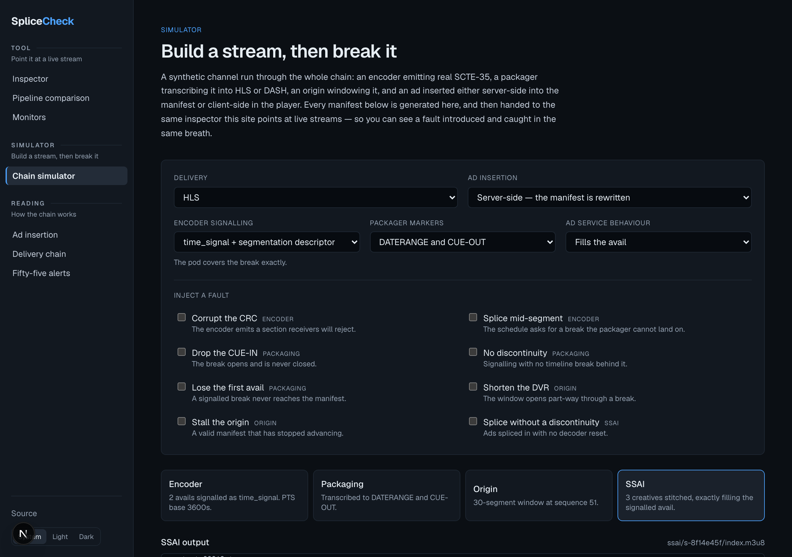
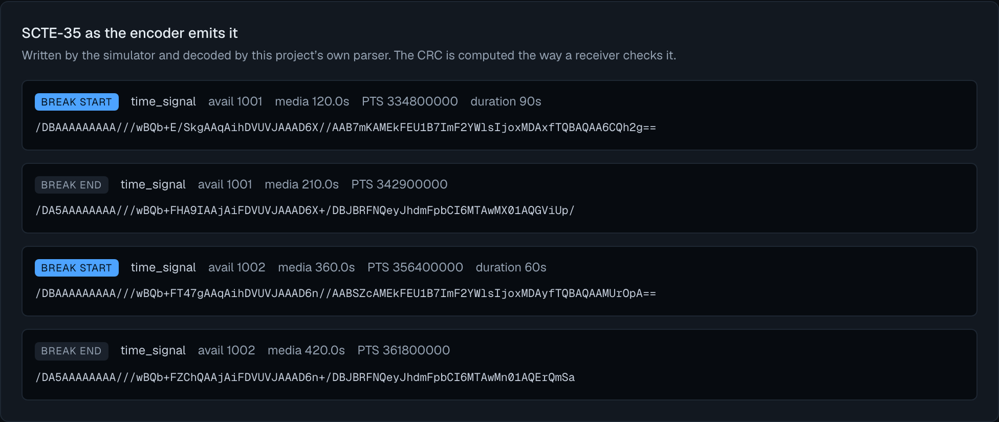
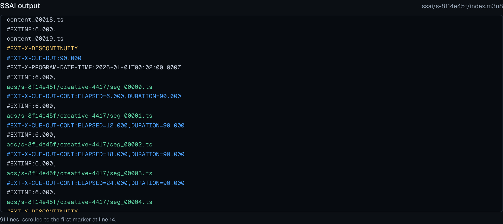
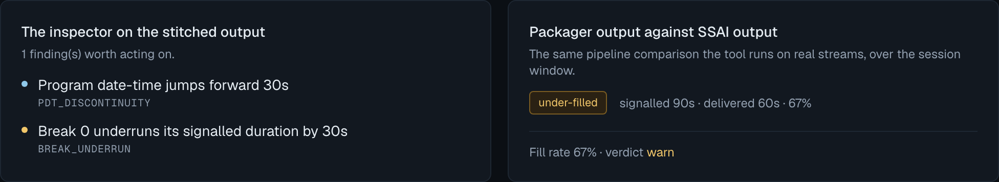

# SpliceCheck

[](https://github.com/sthavana/splicecheck/actions/workflows/ci.yml)

**Ad signalling in HLS and DASH, end to end.** Point it at a live stream and it
reconstructs every ad break, decodes the SCTE-35 riding with it, reads the cues
carried in the segments underneath, and reports the conditions that make
server-side ad insertion mis-fire. Compare the feed going into an ad-insertion
service with the output coming out. Watch a stream continuously and be told when
any of that changes. Or build a stream through the whole chain and break it on
purpose, to see what the rules catch.

**Live demo: [splicecheck.vercel.app](https://splicecheck.vercel.app)** ·
**Reference: [how ad insertion works](https://splicecheck.vercel.app/guide)** ·
**Write-up: [fifty-five alerts and nothing wrong](https://splicecheck.vercel.app/notes/fifty-five-alerts)** ·
**Reference: [the ad response](https://splicecheck.vercel.app/ad-response)** ·
**Reference: [how a stream gets to a viewer](https://splicecheck.vercel.app/streaming)** ·
**Reference: [where video and ad tech talk past each other](https://splicecheck.vercel.app/faq)**

The interface follows the viewer's colour theme, and can be set to light or dark
explicitly.

Five tools, a CLI, and a report you can send someone:

- **Inspector** (`/`) — a one-off look at any stream
- **Pipeline comparison** (`/compare`) — the feed going *into* an ad-insertion
  service against the stitched output coming *out* of it, to see which avails
  were actually filled
- **Monitor** (`/monitors`) — polls on an interval and alerts on transitions
- **Ad response** (`/vast`) — a VAST or VMAP document checked against what
  server-side insertion can actually splice, and against the ladder of a stream
  you name
- **Simulator** (`/simulator`) — builds a stream through the whole chain,
  including the ad decision, so a fault in the ad response can be watched
  surfacing as something else entirely in the manifest
- **Reports** — any result copies or downloads as Markdown for a ticket, or as
  JSON for a pipeline
- **CLI** — the same analysis in a terminal or a build pipeline

> The hosted demo runs the inspector and the comparison in full. Continuous
> monitoring needs a process alive between requests and a disk that survives it,
> which serverless gives neither of — so on the demo that page explains itself
> and offers on-demand polling. Clone it and `npm run monitor` gives the real
> thing (see [Running the monitor](#running-the-monitor)).



---

## Try it without a live stream

Sample manifests ship in `fixtures/samples/`, so the tool demonstrates itself
whether or not any origin is up:

- **Multi-period DASH** — 13 periods, 9 avails, each its own Period with paired
  SCTE-35 start and end descriptors
- **DASH EventStream** — the other DASH convention: avails carried as Events
  with an explicit duration rather than as Periods
- **HLS, dual-signalled** — four renditions, each splice point carried as both
  `EXT-X-DATERANGE` and `EXT-X-CUE-OUT`
- **Packager feed vs SSAI output** — a source and its stitched result, for the
  pipeline comparison

The HLS and DASH EventStream samples are captures of a public demo service. The
multi-period and SSAI samples are generated by scripts in this repository, so no
operator's stream is redistributed here — and every SCTE-35 payload in them is
assembled and then verified by round-tripping it through this project's own
decoder, so a fixture cannot drift from the spec.

```bash
npm install && npm run dev      # then click a sample
```

## What it reports on real streams

**On a live HLS feed**

- The `splice_insert` payloads decode correctly — event ids and break durations
  match the manifest exactly — but their **CRC-32 does not validate**. Strict
  ad decisioning rejects sections with a bad CRC, so these breaks can be
  dropped while looking perfect in the manifest.
  <br>I first assumed the packager had rewritten the section without
  recomputing the CRC. Reading the segments disproved that: the cue carried
  inband in the transport stream has the *same* invalid CRC, so the fault is
  already present when the signal leaves the encoder. That conclusion is not
  reachable from the manifest alone.
- Every break sets `splice_immediate_flag`, so the ad decision server is told to
  switch now rather than at a known PTS, with no time to pre-fetch creatives.
- All four renditions splice at identical points, so cross-rendition comparison
  stays silent — which is the result you want to be able to trust.

- Opening the segments finds the cue carried as an **ID3 `PRIV` frame inside a
  metadata PES**, owner `urn:scte:scte35:2013:bin@` — not on a `stream_type`
  0x86 PID, which is what a scanner looking only for the broadcast form would
  check. Anchored against the segment's first presentation timestamp, all five
  avails resolve to **exactly** the instant the manifest claims: 0.000s drift.

**On the same service's DASH output**

- The avails are carried as `EventStream` Events with an explicit `@duration`
  and `splice_insert` `auto_return`. Nothing closes them and nothing needs to:
  the extent is stated outright. An analyser that insists on a matching end
  descriptor reports every one of these as an unclosed break, which is wrong.
- The same stale CRC-32 appears here, confirming it originates upstream of the
  packaging format rather than in either output path.

**On multi-period DASH**

- Every Period presents identical Representation ids, codecs and resolutions, so
  the stream is continuous across all 12 boundaries — but no Period declares
  `urn:mpeg:dash:period-continuity:2015`. Many players therefore re-initialise
  the decoder at every ad transition, producing a glitch the encoder is not
  causing.


- Avails pair start to end on `segmentation_event_id` and land on their
  signalled duration; every boundary meets to the tick, so nothing is reported
  about the timeline.



## Below the manifest

A manifest is a transcription. An encoder emits SCTE-35 into the transport
stream or into an `emsg` box, and a packager then writes a tag describing it.
Those two can disagree, and nothing in a manifest-only view can see it.

```bash
./dist/cli.mjs <url> --segments 8
```

opens the segments, reads the cues actually carried in them, and checks they
agree with the manifest — for HLS and for DASH:

```
  segments: 6/6 read · 0.86MB · mpeg-ts · 3 inband cues
    2026-09-18T13:41:57.120Z  event 14796122  38.4s  ID3 PRIV on PID 0x23  CRC invalid
    2026-09-18T13:43:58.080Z  event 14796123  38.4s  ID3 PRIV on PID 0x23  CRC invalid
```

**Carriages understood**

| Where the cue lives | |
| --- | --- |
| `emsg` box, versions 0 and 1 | DASH and CMAF segments |
| ID3 `PRIV` frame in a metadata PES (`stream_type` 0x15) | how HLS transport streams usually carry it |
| Section on a `stream_type` 0x86 PID | the broadcast form, straight out of the encoder |

HLS lists its segments outright. DASH does not, so the URLs are built from the
`SegmentTemplate`: `$RepresentationID$`, `$Number$`, `$Time$` and `$Bandwidth$`
with printf widths, the `BaseURL` chain, timelines, and streams addressed by
`@duration` where the segment numbers have to be derived from `@startNumber`
and `@presentationTimeOffset`.

Pointed at the DASH-IF reference stream, which signals inband only:

```
$ ./dist/cli.mjs https://livesim2.dashif.org/livesim2/scte35_1/testpic_2s/Manifest.mpd --segments 8

  DASH · 1 rendition · 0 ad breaks · 60s window

  segments: 32/32 read · 1.16MB · cmaf · 1 inband cue
    2026-09-18T15:01:10.000Z  event 1789743670  20s  urn:scte:scte35:2013:bin

  · SCTE-35 is declared inband INBAND_EVENT_STREAM_DECLARED
  · Avail at 2026-09-18T15:01:10.000Z exists only in the segments INBAND_ONLY_SIGNALLING
```

A manifest-only tool reports that stream as having no ad breaks at all. It has
one; it is in the media.

**What it can then say**

| Code | What it catches |
| --- | --- |
| `INBAND_MANIFEST_TIME_MISMATCH` | The packager transcribed the cue to a different instant than the encoder signalled — systems acting on the manifest and systems acting on the stream splice at different points |
| `INBAND_SIGNAL_NOT_IN_MANIFEST` | The encoder signalled an avail the packager never wrote a tag for. Players and SSAI read the manifest, so the inventory is simply lost |
| `INBAND_MANIFEST_EVENT_ID_MISMATCH` | The same avail counted as two different events in reporting |
| `INBAND_SCTE35_CRC_INVALID` | A bad CRC *at the encoder*, which distinguishes an upstream fault from one the packager introduced |
| `NO_INBAND_SCTE35` | The manifest is the only carriage, so there is nothing to check it against |
| `INBAND_EVENT_STREAM_DECLARED` | The manifest says the segments carry SCTE-35, so a manifest-only view is incomplete by construction |
| `INBAND_ONLY_SIGNALLING` | An avail exists only in the media. Not a dropped cue — the manifest was never transcribing — but anything reading the manifest will see no break |

A cue can sit in one segment out of thirty. Where the manifest carries avails
the search aims at them, but where it carries none there is nothing to aim at,
so the window is scanned instead — and a null result reports what fraction of
it was actually read, because "no cues found" in eight of thirty segments means
very little.

Getting the timing right is the whole exercise. Program date-time names a
segment's first **presentation** timestamp; the PCR leads it by the decoder
buffer delay. Anchoring on the PCR put every cue a constant 0.125s late against
a stream that in fact agrees exactly — a difference small enough to look like a
real defect and to be believed.

## The policy layer

SCTE-35 says *when* something happens. SCTE-224 says *what should be done about
it*: which audiences see an alternate feed, which regions are blacked out, what
replaces the content. The two are delivered separately — the cue rides in the
stream, the policy comes from an ESNI endpoint — so nothing normally checks
they refer to the same thing.

```bash
./dist/cli.mjs <stream> --policy policy.xml
```

```
  policy: 5 media points · 3 matched a signal · 2 matched nothing · 1 signal ungoverned
    mp-blackout-start → break 0  policy/regional-blackout
    mp-break-2 → break 1  policy/alt-content
    mp-no-policy → break 2  no policy

  ▲ MediaPoint mp-break-2 expects 60s but the stream signals 30s
  ▲ MediaPoint mp-no-policy applies and removes nothing
  ▲ MediaPoint mp-orphan matches nothing in the stream
```

| Code | What it catches |
| --- | --- |
| `SCTE224_POINT_UNMATCHED` | A policy expecting a signal the stream does not carry. It will not fire — the blackout or alternate feed simply does not happen |
| `SCTE224_DURATION_MISMATCH` | A policy written for a different length of event than the stream signals, so alternate content will not fit the avail |
| `SCTE224_TYPE_MISMATCH` | Policy and stream describing the same moment as different kinds of event |
| `SCTE224_POINT_NO_POLICY` | A point identifying a moment and attaching nothing to it |
| `SCTE224_POINT_EXPIRED` | Stale points accumulating in a feed, obscuring what is actually in force |
| `SCTE224_SIGNAL_NOT_GOVERNED` | Signals no policy covers — context, not a fault, since a blackout schedule does not govern every ad break |

Points match on segmentation UPID where both sides carry one, and on wall clock
otherwise.

## The harder half: not crying wolf

The first run against a real stream produced 21 errors and 56 warnings. Nearly
all of them were false positives. An engineer stops trusting a tool the first
time it cries wolf, so most of the work here is in **what it deliberately does
not report**:

- A feed carrying signalling but **no discontinuities anywhere** is upstream of
  ad insertion, not broken. Reported once as context, never per break.
- Breaks **clipped by the start of a DVR window**, or still **open at the live
  edge**, are not measurable. Duration rules skip them, and they are excluded
  from cross-rendition comparison.
- Emitting **both a DATERANGE and a CUE-OUT** at one splice point is normal
  dual-signalling — one break, not two. Same for DASH when the same SCTE-35 is
  published in both a standard and a vendor EventStream.
- The **oldest Period in a live window** has usually been trimmed by the
  time-shift buffer, so its media starting after `Period@start` is expected.
- Period continuity is measured against the **video** adaptation set. Audio
  timelines legitimately differ by a frame or two, and averaging them in invents
  a sub-frame gap at every boundary.
- **True signal lead time is not claimed**, because a single poll cannot measure
  it. An earlier version reported it and was quietly wrong; the rule was removed
  rather than left in looking authoritative.
- A live window that **opens part-way through a break** leaves a return whose
  departure has already aged out. That is the window sliding, not a lost signal.
  The same return *after* a break that paired correctly is still an error,
  because then it is not the window boundary.

That last one was found by running the monitor against a live stream for 90
minutes. It alternated between `pass` and `fail` roughly every ten minutes as
the DVR window slid across a break boundary — a healthy stream flapping purely
because of where the window happened to start. Alert fatigue does not announce
itself in a unit test; it shows up after an hour of real traffic.

## What it checks

**SCTE-35** — full `splice_info_section` decoder per ANSI/SCTE 35 2022:
`splice_insert`, `time_signal`, `splice_schedule`, segmentation descriptors,
UPIDs (including MPU format identifiers with their private payload, and MID
sub-UPIDs), break durations, and CRC-32 validation. Accepts base64 or hex.
UPIDs are validated against the format their type declares, not merely
rendered: `UPID_MALFORMED_ADID`, `UPID_WRONG_LENGTH`, `UPID_MALFORMED_URI`,
`UPID_MID_TRUNCATED` and the rest catch a cue that parses perfectly and
identifies nothing.

**HLS**

| Code | What it catches |
| --- | --- |
| `SCTE35_DECODE_FAILED` | Payload isn't a valid splice_info_section — ad servers drop it silently |
| `SCTE35_CRC_INVALID` | Section decodes but the CRC is stale; strict decisioning rejects it |
| `UNCLOSED_BREAK` / `ORPHAN_CUE_IN` / `NESTED_CUE_OUT` | Broken avail state machine |
| `BREAK_OVERRUN` / `BREAK_UNDERRUN` | Segments don't add up to the signalled duration — slate at the tail, or a truncated last ad |
| `SIGNAL_DURATION_DISAGREEMENT` | Manifest duration ≠ SCTE-35 duration; players and SSAI honour different ones |
| `NO_DISCONTINUITY_AT_BREAK_START/END` | Splice point unmarked in a stitched stream — freezes on the return |
| `MAP_CHANGED_WITHOUT_DISCONTINUITY` | The avail carries a different `EXT-X-MAP` — a different decoder configuration — with nothing telling the player to re-initialise |
| `AD_CONTAINER_MISMATCH` | MPEG-TS ad segments spliced into a CMAF presentation, or the reverse; no discontinuity makes that work |
| `DATERANGE_DUPLICATE_ID` / `EVENT_ID_REUSED` | Players and ad platforms deduplicate on these and discard the later ones |
| `DATERANGE_START_DATE_MISMATCH` | A DATERANGE's START-DATE disagrees with where it sits, so schedulers and players fire the break at different instants |
| `TARGETDURATION_EXCEEDED` / `PDT_DISCONTINUITY` | RFC 8216 violations and an inconsistent timeline |

**Cross-rendition (HLS)** — the rules that explain "it only fails on some
devices". Breaks are compared across every variant over the wall-clock window
they share: `VARIANT_BREAK_COUNT_MISMATCH`, `VARIANT_MISSING_BREAK`,
`VARIANT_BREAK_MISALIGNED`, `VARIANT_DURATION_MISMATCH`.

**DASH multi-period** — in DASH an avail is a Period, so different things break.

| Code | What it catches |
| --- | --- |
| `PERIOD_TIMELINE_GAP` / `_OVERLAP` | Period media doesn't meet the next `Period@start` — stall or repeated frame at the boundary |
| `PTO_MISMATCH` | `@presentationTimeOffset` disagrees with `Period@start`, so the Period renders at the wrong time |
| `REPRESENTATION_SET_CHANGED` | The ad Period presents different codecs/resolutions than the content around it, forcing decoder re-init |
| `NO_PERIOD_CONTINUITY_SIGNAL` | Boundaries that are genuinely continuous but don't declare it |
| `AV_DURATION_SKEW` | Adaptation sets in one Period don't cover the same span — lip-sync drift through a pod |
| `EVENT_MISSING_ID` / `EVENT_AMBIGUOUS_TIME` | Events a refreshing client can't deduplicate or order |
| `EMPTY_PERIOD` | An avail was opened and never filled — what a failed ad decision looks like |
| `MUP_LONGER_THAN_SHORTEST_BREAK` | An avail can begin and end between two MPD refreshes and never be seen |

**Remote Periods (DASH xlink)** — the mechanism multi-period DASH actually uses
for server-side insertion: the packager reserves the hole and names a service
that fills it at playback time.

| Code | What it catches |
| --- | --- |
| `XLINK_NO_DURATION` | A placeholder with no `@duration` — the timeline can't be laid out past it, and nothing can be told how much inventory to fill |
| `XLINK_NO_ACTUATE` | Resolution timing left to the client: the ad request goes out minutes early or at the splice point, depending on the player |
| `XLINK_ONLOAD_ON_LIVE` | `actuate="onLoad"` on a manifest refreshed every few seconds — every viewer re-requests the decision at that rate |
| `XLINK_RESOLVE_FAILED` / `_UNPARSEABLE` | The service didn't answer, or answered with something that isn't DASH. The avail is lost and the manifest never said so |
| `XLINK_DURATION_MISMATCH` | Resolved content is a different length than the hole reserved for it, shifting every Period after it |
| `XLINK_CODEC_MISMATCH` | The ad is encoded differently than the programme — decoder tear-down at both ends of the break |
| `XLINK_RESOLVE_SLOW` | The decision took longer than the playback deadline, so it arrived after the moment it was needed |

The last four require making the request a player would make, which is opt-in
for the same reason reading segments is. Everything else in this project can be
judged from a manifest's text; this cannot.

**VAST and VMAP** — the ad response, and whether the creative in it can
actually be stitched. SCTE-35 says an avail exists; this is what goes in it.

| Code | What it catches |
| --- | --- |
| `VAST_EXECUTABLE_CREATIVE` | VPAID is JavaScript and a stitcher has no engine to run it — an all-VPAID response is unfillable by construction |
| `VAST_CODEC_MISMATCH` / `VAST_BITRATE_ABOVE_LADDER` | The creative is encoded unlike the programme, or above the top rung the viewer has ever sustained |
| `VAST_POD_OVERRUNS_AVAIL` / `_UNDERFILLS_AVAIL` | The pod does not fit the break the SCTE-35 asked for — a truncated last ad, or slate at the tail |
| `VAST_NO_IMPRESSION` / `VAST_NO_ERROR_URL` | Nothing to bill against, or no way for the ad server to learn its creative failed |
| `VAST_INCOMPLETE_TRACKING` | Without the quartile set, an ad that ran to the end reports the same as one that failed halfway |
| `VAST_WRAPPER_TOO_DEEP` / `_LOOP` / `_UNRESOLVED` | Redirect chains that exceed the guidance, point back at themselves, or stop dead |
| `VAST_CHAIN_SLOW` | Serial round trips measured against the decision budget — the low-latency rules and these talking to each other |
| `VAST_NO_FILL` | Not malformed: unsold inventory, indistinguishable from a filled break unless someone counts |
| `VMAP_NO_AD_SOURCE` / `VMAP_DUPLICATE_OFFSET` | A scheduled break with nothing to put in it, or two breaks at one instant |



Following a wrapper chain makes real requests to an ad server, so like
reading segments and resolving remote Periods it is opt-in.

**Low latency** — parts and chunks change what the numbers mean. A player sits
about a second behind the edge instead of eighteen, and every ad decision has to
fit inside that.

| Code | What it catches |
| --- | --- |
| `LL_PART_HOLD_BACK_TOO_SMALL` | Below the spec floor of three part durations — clients sit closer to live than the packager can sustain and rebuffer |
| `LL_NO_SERVER_CONTROL` / `LL_NO_BLOCKING_RELOAD` | Parts published without the contract that makes them useful; the latency saved is spent polling |
| `LL_DELTA_UPDATE_DROPS_DATERANGES` | `CAN-SKIP-UNTIL` without `CAN-SKIP-DATERANGES=YES` — the break exists for viewers doing full reloads and not for viewers taking delta updates |
| `LL_DASH_TARGET_UNREACHABLE` | A latency target shorter than a segment, with no chunked delivery to make it reachable |
| `LL_DASH_DELAY_DISAGREEMENT` | `@suggestedPresentationDelay` and `ServiceDescription` naming two different live points |
| `LL_DASH_EARLY_AVAILABILITY_WITHOUT_CHUNKING` | Segments offered early while still claimed complete — clients fetch a truncation or a 404 |
| `LL_AD_DECISION_BUDGET` | Not a fault: the hold-back or latency target stated outright, because it is the entire time an ad decision has |

## The monitor

Add a stream, pick an interval, optionally give it a Slack webhook. Each poll
runs the same analysis the inspector does — so the alerts and the UI can never
disagree — then compares the result with the previous poll.

**Alerts fire on transitions, not on state.** A monitor that pages you every
minute about a condition that has been true since Tuesday is a monitor people
mute. A fault alerts when it *appears*; the same fault next poll is silent;
clearing it alerts once.

| Alert | Why it matters |
| --- | --- |
| `SIGNALLING_STOPPED` | Stream up, players happy, nothing being monetised. Does not look like an outage. |
| `BREAK_STUCK_OPEN` | A break past its signalled duration with no return. Players are still in ad mode. |
| `NEW_<code>` | Any error or warning not present on the previous poll |
| `VERDICT_DEGRADED` | pass → warn → fail |
| `STREAM_UNREACHABLE` | Two consecutive failures, so one CDN hiccup stays quiet |
| `STREAM_RECOVERED` / `ERRORS_CLEARED` / `SIGNALLING_RESUMED` | The all-clear |





**Tracking a pipeline continuously.** Give a monitor a stitched output URL as
well as a source and every poll runs the comparison, so fill rate becomes a
metric with a history rather than a number someone checked once. On top of the
alerts above: `AVAILS_NOT_STITCHED`, `AVAILS_PASSED_THROUGH`, and
`FILL_RATE_DROPPED` when the proportion of signalled avail seconds actually
filled falls by more than ten points between polls. Small movement is ignored —
fill rate wobbles with where the window falls, and alerting on every percentage
point makes the monitor unreadable.

A new monitor's first successful poll establishes a baseline and does not alert
on pre-existing faults — otherwise adding a stream floods you. A finding that
occurs in several renditions is one alert, not one per rendition.

**What live polling taught it.** The first long run produced 55 alerts across
90 minutes for two healthy streams. Not one described a real fault. Six
separate causes, each only visible under real traffic:

1. A fault present in four renditions raised four identical alerts. One fault
   is one alert; the rendition count belongs in the detail.
2. A live window opening part-way through a break leaves a return whose
   departure has already aged out.
3. The next departure after such a break then looks nested.
4. A DATERANGE stays in the playlist until its whole range rolls out, so the
   oldest one ends up in front of a later segment than it originally preceded
   and its START-DATE reads early — by a margin that *grows* with every
   refresh, which is the tell.
5. Renditions roll independently, so a break near the edge of the shared window
   can exist in one and not another.
6. Audio and video are published independently, so the newest period on a live
   manifest always has a timeline skew until it is complete.

Together, 2 and 3 made a healthy stream alternate between `pass` and `fail` as
the window slid across a break boundary, trading `VERDICT_DEGRADED` and
`ERRORS_CLEARED` ten times over.

The fix is the same shape every time: **suppress at the boundary, keep the rule
everywhere else.** A window-edge orphan CUE-IN is info; the same orphan after a
break that paired correctly is still an error. A break near the shared window
edge is skipped for cross-rendition comparison; one in the middle is not. The
noise goes away without blinding the tool.

None of this was visible in the test suite until the behaviour was understood
well enough to write a test for it. All six are now covered.

## The simulator: building a stream to break it

Everything above reads streams. Nothing writes one, which means every rule is
tested against manifests whose ground truth is somebody else's guess. The
simulator is the other direction — a synthetic channel run forward through the
chain, then handed to the analyser that already exists.



An encoder emits real SCTE-35, a packager transcribes it into HLS or DASH, an
origin windows it, and an ad is inserted either server-side into the manifest or
client-side in the player. Eleven faults can be switched on, each one a failure
seen in the field rather than an arbitrary toggle.

**The SCTE-35 is real, not a plausible-looking string.** `scte35Encode.ts` is
the exact inverse of the decoder, and the tests hold the two against each other:
every section must decode back to what went in with a valid CRC, and the
published `splice_insert` vector is reproduced byte for byte through the command
— `section_length` differs by exactly the 10-byte avail descriptor the vector
carries and the simulator has no use for.



**The manifests are generated, not canned.** The SSAI stage rewrites the
window: ad segments in place of programme, a discontinuity per creative, and
`EXT-X-CUE-OUT-CONT` counting the elapsed time through the break.



**And then it is graded by the same code that grades real streams.** Switch the
ad service to under-fill and the inspector reports `BREAK_UNDERRUN` while the
pipeline comparison — the same one behind `/compare` — calls the avail 67%
filled.



Writing it found four modelling errors, each caught by the analyser disagreeing
with what the simulator claimed to have built: segments inside an avail were
named differently from programme segments, which made a pass-through look like a
real substitution; under-fill padded the break back to full length, so it
measured as correctly filled; the ad service stitched breaks the packager had
never transcribed, when a real one reads the manifest and cannot see them; and
the DASH comparison ran against the HLS playlists.

It also found a gap in the rules. A break left open past its own declared
duration was only ever `info`, on the grounds that a break on air looks the same
as one whose return was lost — but the declared duration is in the manifest and
knowable from a single poll. `BREAK_OVERRUN_UNCLOSED` now fires past a margin of
two target durations, in both HLS and DASH, where the DASH shape of the same
fault is a Period that keeps growing with no later Period picking the programme
back up.

Every fault has a test that it fires, and — the half that matters more — that a
clean run stays silent.

## Testing

```bash
npm test      # 207 tests across 12 files
```

- **Spec vectors** — the SCTE-35 decoder is asserted against published ANSI/SCTE
  35 vectors, including CRC validation, so a regression fails the build rather
  than silently mis-reading a stream.
- **Planted defects** — `fixtures/broken.m3u8` and `fixtures/broken.mpd` each
  carry a set of deliberate faults; the suite asserts every one is reported.
- **Sample manifests** — the shipped samples are asserted on too: that
  multi-period avails pair on `segmentation_event_id` and their boundaries meet,
  that an avail bounded by `auto_return` is not called open, and that
  cross-rendition comparison stays *silent* on a stream whose renditions agree.
- **Alert transitions** — including the case that matters most: a steady,
  unchanged stream must produce no alerts at all.
- **Pipeline comparison** — every SSAI outcome is asserted against a worked
  source/output pair, and a correctly stitched stream must produce *no findings
  whatsoever*. A tool that cannot stay silent on a healthy pipeline is useless
  on an unhealthy one.
- **Round-tripped signalling** — every section the SCTE-35 encoder writes must
  decode back through this project's own parser to what went in, with a valid
  CRC. The two cannot drift apart without a test failing.
- **The chain, end to end** — each fault the simulator can inject must produce
  its finding, and a clean run must produce none. Both halves are asserted for
  every fault, which is the only way a suppression can be distinguished from a
  rule that stopped working.

## CLI

The same analysis in a terminal or a build pipeline. One bundled file, no
runtime dependencies beyond Node.

```bash
npm run build:cli      # -> dist/cli.mjs
```

### Analysing a stream

Takes a URL or a path, so it works against a live origin or a captured
manifest, HLS or DASH:

```
$ ./dist/cli.mjs https://demo.unified-streaming.com/k8s/live/scte35.isml/.m3u8

https://demo.unified-streaming.com/k8s/live/scte35.isml/.m3u8
  HLS · 4 renditions · 5 ad breaks · 601s window · 31.9% ad load

  ▲ SCTE-35 CRC-32 does not validate SCTE35_CRC_INVALID 1280x720 @ 658kbps ×20
    The section decodes, but its CRC-32 is wrong (0xe4612424). Strict ad servers
    and SCTE-35 conformance checkers reject sections with a bad CRC, so this
    break may be silently ignored even though it looks correct in the manifest.
  · Break 0 uses splice_immediate_flag SPLICE_IMMEDIATE 1280x720 @ 658kbps ×4
    The splice_insert has no pre-roll time, so the ad decision server is told to
    switch now rather than at a known PTS. Fixed-latency ad systems cannot
    pre-fetch creatives against an immediate splice and will commonly return
    slate for the first few seconds.
```

The same finding in four renditions is one finding with a `×4`, not four lines.
`--quiet` drops the explanations and keeps the verdict:

```
$ ./dist/cli.mjs fixtures/broken.m3u8 --quiet

fixtures/broken.m3u8
  HLS · 1 rendition · 3 ad breaks · 76s window · 47.7% ad load

  ✖ Segment longer than EXT-X-TARGETDURATION TARGETDURATION_EXCEEDED broken.m3u8 · line 23
  ✖ SCTE-35 payload could not be decoded SCTE35_DECODE_FAILED broken.m3u8 · line 37
  ✖ Return-from-break with no matching break start ORPHAN_CUE_IN broken.m3u8 · line 34
  ✖ Break 2 is never closed UNCLOSED_BREAK broken.m3u8 · line 37
  ▲ SCTE-35 CRC-32 does not validate SCTE35_CRC_INVALID broken.m3u8 ×2
  ▲ EXT-X-DATERANGE "break-2" declares a start 5.5s before where it sits DATERANGE_START_DATE_MISMATCH broken.m3u8 · line 24
  ▲ Break 0 underruns its signalled duration by 20.4s BREAK_UNDERRUN broken.m3u8 · line 10
  ▲ Break 0 returns to content without EXT-X-DISCONTINUITY NO_DISCONTINUITY_AT_BREAK_END broken.m3u8 · line 19
  · Breaks are signalled with more than one tag at the same point DUAL_SIGNALLING broken.m3u8

  FAIL  4 errors, 10 warnings, 3 info
```

### Reading the segments

`--segments` opens the media and decodes the SCTE-35 carried in it, then checks
it against the manifest. Works for HLS and DASH:

```
$ ./dist/cli.mjs https://demo.unified-streaming.com/k8s/live/scte35.isml/.m3u8 --segments 4

  segments: 4/4 read · 0.59MB · mpeg-ts · 2 inband cues
  ▲ Inband SCTE-35 CRC-32 does not validate INBAND_SCTE35_CRC_INVALID 1280x720 @ 658kbps ×2
```

That pair of findings is the argument for the feature: the manifest carries a
bad CRC and so does the media underneath it, which places the fault at the
encoder rather than at the packager that transcribed it.

### Comparing a feed with its stitched output

```
$ ./dist/cli.mjs compare fixtures/samples/ssai-source/playlist.m3u8 \
                         fixtures/samples/ssai-output/playlist.m3u8

source fixtures/samples/ssai-source/playlist.m3u8
output fixtures/samples/ssai-output/playlist.m3u8

  fill rate 40.0%  48s of 120s signalled across 4 avails

  12:00:12  signalled     30s  output     30s  filled
  12:00:54  signalled     30s  output     18s  under-filled
  12:01:30  signalled     30s  output     30s  passthrough
  12:02:06  signalled     30s  output      —s  not-stitched

  ✖ Avail 2 exists in the output but nothing was substituted into it AVAIL_PASSED_THROUGH
  ✖ Avail 3 was signalled but never appears in the output AVAIL_NOT_STITCHED
  ▲ Avail 1 is 12s short of the 30s that was signalled AVAIL_UNDER_FILLED

  FAIL  2 errors, 2 warnings, 0 info
```

### A report you can send someone

`--markdown` produces the same report the web tool copies, which states what was
checked as well as what was found:

```
$ ./dist/cli.mjs fixtures/broken.m3u8 --markdown

# Ad signalling report

**Source:** `fixtures/broken.m3u8`
**Taken:** 2026-09-22 12:28:58Z
**Verdict:** FAIL — 4 error(s), 10 warning(s), 3 note(s)

## What was checked

- 1 rendition(s), HLS
- 3 ad break(s) reconstructed
- 12 segment(s) spanning 75.5s (on demand)
- Segments were not opened, so only the manifest was checked

## Errors (4)
...
```

`--json` emits the full analysis instead, for something downstream to parse.

### In a build pipeline

Exit codes are the point:

| Code | Meaning |
| --- | --- |
| `0` | No errors — and no warnings either, under `--strict` |
| `1` | Problems found |
| `2` | Could not analyse the input at all |

The distinction between 1 and 2 matters: a CDN timeout is not a stream fault,
and a pipeline that treats them alike will either page somebody at 3am for a
network blip or swallow a real defect.

```yaml
- name: Ad signalling must be clean
  run: ./dist/cli.mjs "$STREAM_URL" --strict --quiet
```

Comparing a source against itself exits `1`, which is correct rather than a
quirk: if the output is identical to the input then nothing was substituted,
and that is a pipeline that did not run.

### Every flag

| Flag | |
| --- | --- |
| `--json` | the full analysis as JSON, for piping |
| `--markdown` | a findings report as Markdown, for a ticket |
| `--strict` | exit non-zero on warnings as well as errors |
| `--quiet` | findings only, without the explanation of each |
| `--variants <n>` | maximum HLS renditions to fetch (default 6) |
| `--segments [n]` | open n segments and read the SCTE-35 inside them (default 8) |
| `--policy <file\|url>` | an SCTE-224 document, checked against the stream's signals |

## Architecture

```
src/lib/scte35.ts      splice_info_section decoder (no dependencies)
src/lib/hls.ts         HLS playlist parser
src/lib/dash.ts        MPD parser — multi-period, EventStream, SegmentTimeline
src/lib/analyze.ts     HLS break reconstruction + rules + cross-rendition
src/lib/analyzeDash.ts DASH period analysis + rules
src/lib/runner.ts      one analysis path, with the fetcher injected
src/lib/pipeline.ts    source vs stitched-output comparison
src/lib/monitor.ts     polling, transition diffing, alert delivery
src/lib/store.ts       SQLite state
src/lib/mp4.ts         ISO BMFF box walking and emsg extraction
src/lib/ts.ts          MPEG-TS: PAT, PMT, cue sections, ID3-in-PES
src/lib/segments.ts    reads segments and checks them against the manifest
src/lib/scte224.ts     policy documents, lined up against the stream's signals
src/cli.ts             terminal interface over the same analysis
```

The fetcher is injected, so the identical analysis runs against the network, a
recorded bundle, or a test fixture. The monitor calls the same `analyzeUrl` the
API does.

### Running the monitor

```bash
git clone https://github.com/sthavana/splicecheck.git
cd splicecheck
npm install
npm run monitor
```

Then open `http://localhost:3000/monitors`, add a stream, and leave it.

State lives in SQLite at `./data/splicecheck.db` (override with
`SPLICECHECK_DB`), so runs and alerts survive a restart. The poller runs
in-process, so it needs a long-lived Node process — `npm run monitor`,
`npm start`, or a container. A serverless deployment would need a hosted
database and a cron route instead.

`npm run monitor` is `npm run dev` with a wake lock held (`caffeinate -im` on
macOS). The poll loop lives in that process and stops whenever the machine
sleeps: a Mac left alone drops into maintenance sleep for about four minutes at
a stretch and wakes for forty-five seconds, which left a night of monitoring
here 57% covered before anyone noticed. The monitors page now shows observed
coverage beside the interval so a sparse night cannot read as a quiet one.

## Not done yet

- Per-creative breakdown inside a filled avail — which creatives ran, and
  whether the pod was assembled as the ad server intended
- Reading segments during a monitor poll, rather than only on demand
- SCTE-104, the upstream contribution-side form of the same signalling

## Licence

MIT — see [LICENSE](LICENSE).
